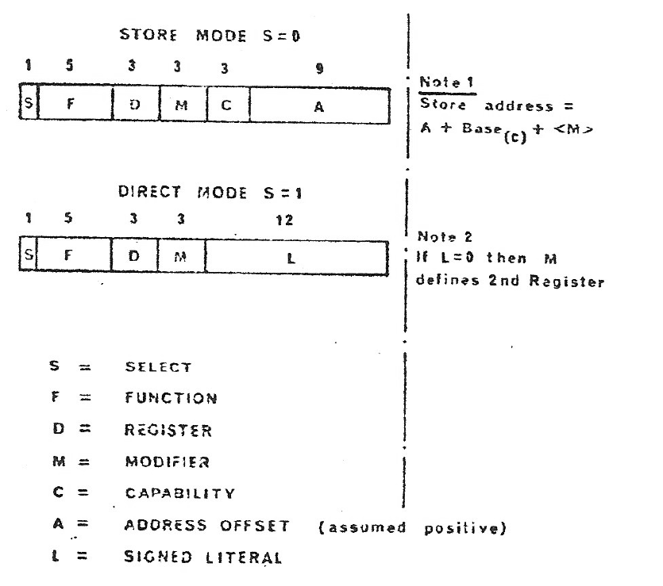

# PP250-G2 — Recovered System 250 Architecture

## Status

**WORKING ARCHITECTURAL RECONSTRUCTION**

This document gives a coherent architectural description of the mature System 250 represented by the c. 1975–76 evidence. The purpose is to describe the machine on its own terms. It is not a source review, an evolutionary history, or a catalogue of every unresolved implementation detail. Where surviving evidence leaves a detail open but that detail is not required to explain architectural behaviour, it is left unspecified.

Detailed provenance and the reasoning trail remain in the repository's research and transcription material.

## 1. Architectural character

**PP250 provides an unforgeable authority substrate from which software can construct and enforce arbitrary programmer-defined authorities. It enables an authority-structured hardware and software system built recursively upon that substrate: authority protects computation and resources, contains faults and supports recovery from them, while the mechanisms that manage, protect and recover the system are themselves governed by authority from that very same substrate.**

There is no kernel, no separately protected operating system, and no privileged instruction set or supervisor mode. The entire system is built recursively from unforgeable authority primitives. System software does not stand above the authority architecture: it is constructed within it and is governed by it.

Authority is not confined to hardware-defined operations such as reading, writing or executing store. The architectural authority primitives in PP250 provide the foundation from which software can construct higher-level authorities with arbitrary software-defined semantics.

The architecture is described below at machine-instruction level, not because authority is defined at that level, but because this exposes where its enforcement ultimately resides. Higher-level software—languages, compilers and system structures—can create richer semantics and impose additional constraints. Where those structures express authority through the PP250 authority mechanisms, that authority survives their translation into machine code: its enforcement does not depend on the correctness or continued cooperation of the higher-level abstraction, but ultimately rests on mechanisms enforced by the processor itself.

PP250 enforces a software-defined protected structure in hardware: once authority has been restricted to that defined structure, there is no path around it. A program can exercise only that defined authority. The authority restriction survives all the way down to machine code; it does not depend on programming convention, the compiler, or a privileged operating system. It is baked into the very wiring of the processor.

The protected structure and its semantics are defined by software. It may represent a file, process, device, directory, allocator, operating-system service or application object. Such structures can themselves hold and expose authority, allowing them to be composed recursively into complete software systems.

Conceptually, a protected structure combines state with a defined set of operations upon that state. It is readily recognisable as the encapsulated abstraction represented in modern programming languages by objects, classes and other structured types.

Before going any further, it is useful to introduce a few definitions and important concepts:

- **Structure** — a block of memory with defined bounds, to which a capability refers.
- **Access (authority)** — a subset of the hardware-enforced access rights over that structure.
- **Capability** — a reference to a structure, together with an access (authority) over that structure.
- Different capabilities may refer to the same structure with different access (authorities) over it.

**Using these defined primitives, we can construct a protected structure representing an object.** The object consists of executable code structures or segments representing functions that operate upon data structures representing the state of the object. Capabilities provide the required access to each of these structures: execution access to the code, and whatever data access each data structure requires — for example read-only, write-only, or read-write access.

The capabilities defining the object are **assembled into a capability block**. The capabilities within that block therefore define both the functions that may operate upon the object and the data upon which those functions operate.

**We now need a new class of capability through which this capability block can itself be referenced in a protected way.** Such a capability must not allow its holder to read or modify the capabilities contained within the block. It must permit only the invocation of one of the functions represented within the block, without exposing the capabilities from which the object is constructed.

**Armed with an instance of this new capability, all its holder can do is invoke the functions made available through it.** The implementation of those functions, the data upon which they operate, and the accesses required to perform those operations remain within the protected structure. The holder cannot bypass those functions to obtain access to the underlying code, data or capabilities. That restriction is enforced by the hardware.

An **unforgeable token** is an architectural entity representing a reference to a bounded structure together with the access permitted through that reference. The token may have different representations during its lifetime, but those representations do not alter the **access or bounds of the structure represented by the token**.

**At this point the primary architectural concept can be stated simply.** An object's protected space is defined by a collection of unforgeable tokens: tokens giving access to the functions that implement its operations and to the data upon which those functions operate. A further unforgeable token provides controlled access to the object without exposing the tokens from which its protected space is constructed.

This construction is deliberately general. Such protected objects can represent structures at essentially any level of a computing system: application objects and complete applications, files and filing systems, memory and resource managers, devices and communications services, network access, or system services themselves. Protected objects may themselves hold tokens giving controlled access to other protected objects, allowing larger structures to be composed recursively from the same architectural primitive, **with the hardware enforcing access and enforcing the bounds of each object's protected space.**

**A protected object need not have a single form of access.** Different unforgeable tokens may refer to the same object while granting different access to it. The object and its protected space remain the same; what differs is the access permitted through each token.

**For such a system to exist, the architecture must both maintain an authoritative record of the unforgeable tokens that exist and provide protected representations of those tokens wherever they are required.** A token may need to be represented in memory, in backing store, or in an active processor context. These representations may differ, but each must remain unforgeable and preserve the access and bounds of the structure to which the token refers.

**These two requirements can initially be considered separately: the token record and the token representation.**

**PP250-G2** is a 24-bit capability computer in which ordinary computation, protected naming, protected invocation, process state, virtual storage and system control form one architecture.

Its central separation is:

- **data and instruction computation** uses the ordinary data path and data registers;
- **authority and protected naming** are represented by capabilities;
- **microprogrammed processor mechanisms** enforce capability use and perform transitions that ordinary software cannot manufacture for itself.

A useful reconstruction is a model denoted by M⟨H,T⟩: T describes ordinary von-Neumann computation, H describes capability-mediated protected computation, and M is the processor mechanism that implements and coordinates transitions involving both. M is reconstruction terminology, not an historical System 250 name.

## 2. Programmer-visible state

The programmer-visible execution state is more than a register file. It includes the current instruction stream and addressing context, the ordinary data and capability registers, condition/indicator state, and the protected execution context established by C6 and C7. Some additional processor-control state is visible only through the special/internal mechanisms described later.

The ordinary general-purpose register set consists of:

- eight 24-bit data registers, D0–D7;
- eight capability registers, C0–C7.

A loaded capability register contains the information needed to address and protect a store block: a base, a limit and an access authority.

C0–C5 are general capability registers.

C6 and C7 have defined execution roles:

- **C6** identifies the principal capability block of the currently executing process;
- **C7** identifies the currently executing code block.

The Instruction Address Register selects the current instruction relative to the code capability in C7.

## 3. Instruction addressing and protection

PP250-G2 has Store and Direct instruction forms.

In Store mode an effective store address is constructed from the base of the selected capability, the instruction's address offset and, where selected, a data-register modifier. Conceptually:

```text
effective address = C[n].BASE + offset + modifier data-register value
```

The contemporary processor description shows the two instruction formats directly:



*Figure: Store and Direct instruction formats from Halton, “Hardware of the System 250 for Communication Control”.*

Before access, the processor verifies that the address lies within the capability bounds and that the requested operation is permitted by its access field. An invalid access enters the fault machinery rather than merely producing an unchecked physical address.

Direct mode supplies a literal or register operand and does not require a normal store reference.

## 4. Capability authority

The mature architecture names six semantic access rights:

```text
EC   Enter Capability
WC   Write Capability
RC   Read Capability

ED   Execute Data
WD   Write Data
RD   Read Data
```

The distinction between capability operations and data/code operations is architectural. A capability may therefore grant authority to manipulate protected references without necessarily granting ordinary data access to the represented block, and conversely.

The Pocket Reference records COS and POS access-field layouts containing these six rights. Their surrounding representation differs. PP250-G2 reconstruction preserves those source-specific layouts without requiring a universal interpretation of every surrounding bit.

## 5. Stored and loaded capabilities

A capability stored in memory is a compact protected reference. For an active System Store capability its essential architectural information is:

```text
access authority + SCT identity
```

It does not need to contain the current physical base and limit.

Loading a capability resolves its System Capability Table identity and obtains the corresponding descriptor information. The processor can then construct the expanded capability-register state:

```text
stored capability
  ACCESS + SCT identity
             |
             v
          SCT entry
       BASE / LIMIT
             |
             v
      capability register
   BASE / LIMIT / ACCESS
```

The System Capability Table therefore separates stable protected reference identity from the current physical location and bounds of the represented object.

Capability loading is protected by hardware checks including descriptor sumcheck and capability integrity checking.

## 6. System Capability Table

The SCT is reached through the special capability C(C).

A PP250-G2 SCT entry is a three-word descriptor family containing the information required to validate and expand an active capability, including:

- SUMCHECK;
- BASE;
- LIMIT;
- Generation-2 object-management state.

The access authority exercised by a program originates in the capability being loaded; the SCT does not independently grant arbitrary rights to the holder.

PP250-G2 evidence also establishes SCT state used by the garbage-collection and allocation machinery, including **GARBAGE** and **VISITED**.

Changing an SCT descriptor does not by itself rewrite capability registers that have already been expanded. Where such state must be refreshed, the architecture can use protected process interruption/restoration so that saved compact identities are resolved again through the current SCT.

## 7. LDP

LDP exposes the compact pointer associated with a capability as ordinary data.

For example:

```text
LDP D2 C3
```

in direct form loads D2 with the compact capability pointer associated with C3.

This implies that the processor retains sufficient association between an expanded capability and its compact protected identity for that pointer to be recovered. No later pointer-register architecture is required to explain the PP250-G2 instruction.

The historical software uses of LDP are not required to define its architectural operation.

## 8. Protected CALL and RETURN

Protected invocation is built into the capability architecture.

A caller may possess an Enter Capability to another node's principal capability block. A CALL through that capability, with an offset selecting an executable entry, establishes the called execution domain.

Conceptually:

```text
Enter Capability
       |
       +---- offset ----> Execute capability
```

The processor then establishes:

```text
C6 = called node's principal capability block
C7 = selected executable code capability
IAR = called entry point
```

and preserves the caller's:

```text
C6
C7
return IAR
```

on the Process Dump Stack.

C0–C5 are not replaced by this transition. They can therefore carry data authority and parameters across the protected interface. Data registers likewise remain ordinary call-visible state.

RETURN restores the saved C6, C7 and IAR.

CALL is consequently a protected call, not a complete process-context replacement.

## 9. Process Dump Stack

Each active process has a Process Dump Stack identified by C(D).

The 1976 format has a common fixed process-state area containing:

```text
0–5       C0–C5
6–15      D0–D7
16        pushdown pointer for CALL stack
17        watchdog timer
20        MIP
```

Beyond that fixed state, the format contains system-dependent process information and the C6/C7/IAR execution frames used by protected calls.

The same protected structure therefore supports two related requirements:

1. preservation/restoration of process architectural state;
2. the nested C6/C7/IAR stack required by CALL and RETURN.

The operating systems differ in their additional Dump Stack fields and initial layouts; those differences are not part of the processor definition.

## 10. Process change

**CHP (Change Process)** is distinct from CALL.

CALL changes protected execution domain while remaining within the same process and Process Dump Stack.

CHP performs a process transition: the outgoing process state is preserved and an incoming process state is established from its protected process-state structure.

The architectural distinction is:

```text
CALL / RETURN
    same process
    same Process Dump Stack
    push/pop C6, C7, IAR

CHP
    process transition
    preserve outgoing process state
    establish incoming process state
    change active Dump Stack
```

PP250-G2 provides both Store and Direct forms of CHP. The processor architecture does not require us to assign those forms to a particular operating-system process-creation policy in order to explain process switching.

## 11. Special processor state

PP250-G2 defines a second group of special-purpose processor registers.

The documented special capability registers are:

```text
C10   C(D)   Process Dump Stack
C11   C(I)   Interval Timer / system interrupt structure
C12   C(C)   System Capability Table
C13   C(N)   Normal Interrupt Block
```

C(S), the Fault Start-Up capability, is a separate special capability.

Documented special data registers include:

```text
D10   absolute Dump Stack pushdown pointer
D11   watchdog timer
D12   first-fault MIF copy
D15   interrupt accept register
D17   instruction address register
```

The Primary, Secondary and Fault Indicator registers contain processor control and fault state.

These structures allow protected system mechanisms to operate without introducing a conventional unrestricted supervisor address space.

## 12. Normal interrupts

Normal system interrupts are capability-mediated.

C(I) provides access to the system interrupt information and C(N) identifies the Normal Interrupt Block. The processor periodically examines the interrupt state, selects an eligible request and enters the corresponding protected system handling path.

Normal interrupt handling can cause a process transition using the same protected process-state machinery used elsewhere by the architecture.

The important architectural point is that an interrupt does not simply install an arbitrary privileged program counter. The destination and its authority are represented by protected system structures.

## 13. Fault and start-up path

Fault handling is distinct from normal interrupt handling.

C(S) identifies the Fault Start-Up Block and provides the protected root for fault/start-up execution. The startup/fault root is established by architectural hard-wired or preset processor state rather than being authority that ordinary software must manufacture. Contemporary descriptions show this mechanism being used to enter restricted checkout/recovery code following detected processor or capability failures.

Thus PP250-G2 has two deliberately different exceptional roots:

```text
C(N)   normal interrupt/system dispatch
C(S)   fault/start-up/recovery
```

They may ultimately use common process-state machinery, but they are not the same entry mechanism. Exact generation-specific cold-load and microinstruction sequencing is an implementation/documentary matter rather than an unresolved authority mechanism.

## 14. Virtual storage and Inform/Outform

Virtual storage is integrated with the capability/object architecture rather than being a separate conventional virtual-address translation layer.

An active or **Inform** capability identifies an object through the System Capability Table. A passive or **Outform** representation carries the persistent backing-store identity needed while capability-containing material is represented outside primary store.

Conceptually:

```text
Inform
active protected reference
SCT identity
       |
       | virtual-store management
       |
       v
Outform
persistent backing-store identity
```

When capability-containing blocks move between primary and secondary storage, their contained protected references can be converted between the appropriate representations by the virtual-storage machinery.

Nonresident access and materialisation are handled through the established trap/storage-management mechanism. PP250-G2 does not require a later SCT PRESENCE mechanism to explain this behaviour.

## 15. Resource creation

Ordinary software does not need the ability to fabricate capabilities.

System resource-allocation services are themselves reached through capability-protected interfaces. Contemporary System 250 material describes a Common Facilities Block exposing services such as store, process, flag, stream, text-file, directory and job allocation.

An allocator creates the appropriate resource and returns a capability giving the caller the permitted authority over it.

Thus new authority enters an ordinary process through an already-authorised protected operation rather than by constructing an arbitrary capability bit pattern.

## 16. Object lifetime and garbage collection

The capability system forms a graph of protected references.

PP250-G2 includes background garbage-collection machinery capable of traversing capability-containing blocks and identifying reachable SCT objects. GARBAGE and VISITED state in the SCT supports this process.

At the architectural level:

```text
roots
  |
  v
capability-containing blocks
  |
  v
contained capability references
  |
  v
referenced SCT objects
```

Objects not reachable under the collection rules can eventually become eligible for reclamation. Explicit release is a distinct operation and can invalidate existing references to the released resource.

This mechanism depends on the architectural distinction between capability-containing storage and ordinary data; the collector does not need to guess which arbitrary data words might be capabilities.

## 17. Multiprocessor and I/O model

System 250 is a symmetric multiprocessor architecture. CPUs share system work rather than having permanently assigned operating-system roles.

Store modules and device-access structures are connected through the system bus architecture. Store Access Units arbitrate concurrent access and participate in integrity checking.

I/O is deliberately integrated into the normal protected addressing model. Device registers can appear as addressed resources, while CPU processes perform polling and block transfers. System interrupts communicate system events without binding a device permanently to a particular CPU.

This model allows processors, stores and peripheral modules to be added or removed within a capability-constrained system structure.

## 18. Architectural invariants

The recovered PP250-G2 architecture is characterised by the following invariants:

1. **Ordinary store access is capability-relative.** A program does not generate an unrestricted physical address.
2. **Authority accompanies the protected reference.** The SCT supplies object representation, not arbitrary authority.
3. **Stored capability identity is distinct from expanded physical addressing state.**
4. **C6 and C7 define the current protected execution context.**
5. **CALL changes domain, not process.**
6. **CHP changes process.**
7. **The Process Dump Stack is protected architectural state, not an ordinary language stack.**
8. **Normal interrupt and fault/start-up entry are capability-rooted.**
9. **Resource creation returns capabilities through already-authorised services; ordinary programs need not fabricate them.**
10. **Virtual storage preserves protected object identity across physical movement.**
11. **Capability-containing storage is distinguishable from ordinary data, enabling capability-aware lifecycle management.**
12. **No conventional unrestricted supervisor mode is required to explain normal system operation.**

Together these properties explain the surviving programmer-visible, operating-system and protection behaviour without importing later architectural mechanisms.

## 19. Deliberately unspecified details

The following details are not required to make the PP250-G2 architecture internally coherent and are therefore not invented here:

- a universal interpretation of every non-right bit in the COS and POS access diagrams;
- functions for undocumented C14–C17 and blank special data-register entries;
- exact microinstruction sequencing of the architectural operations;
- operating-system-specific process-construction policy;
- exact cold-load/commissioning details beneath the documented hard-wired/preset startup root;
- bit-for-bit correspondence with earlier or later System 250 generations.

These are implementation, representation, system-policy or historical-evolution questions unless further evidence shows that one of them changes PP250-G2 architectural behaviour.

## 20. Reconstruction conclusion

On the current repository evidence, PP250-G2 forms an internally consistent architecture.

The processor has documented protected roots for ordinary capability resolution, process state, normal interrupt handling and fault/start-up. Stored capability identity, SCT-mediated expansion, C6/C7 protected invocation, Process Dump Stack state, CHP process transitions, virtual storage, resource allocation and capability-aware object lifetime fit together without requiring an additional undocumented privilege mechanism.

There are currently **no identified unresolved architectural blockers** meeting the repository's open-question admission rule. Further source work may refine encodings, microsequences and operating-system policy without changing that conclusion.
