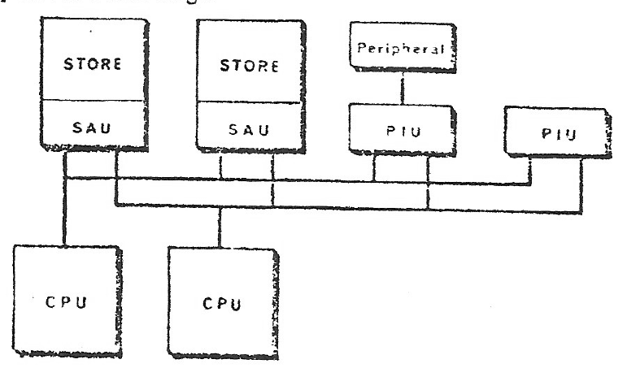
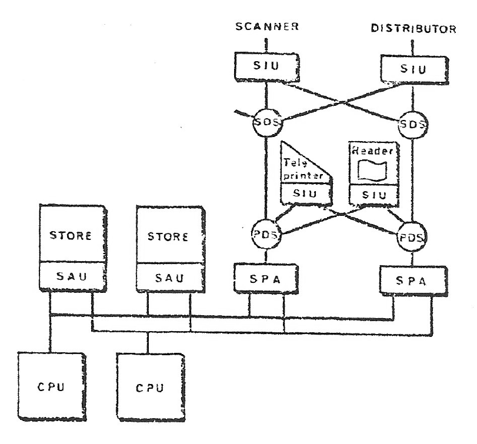
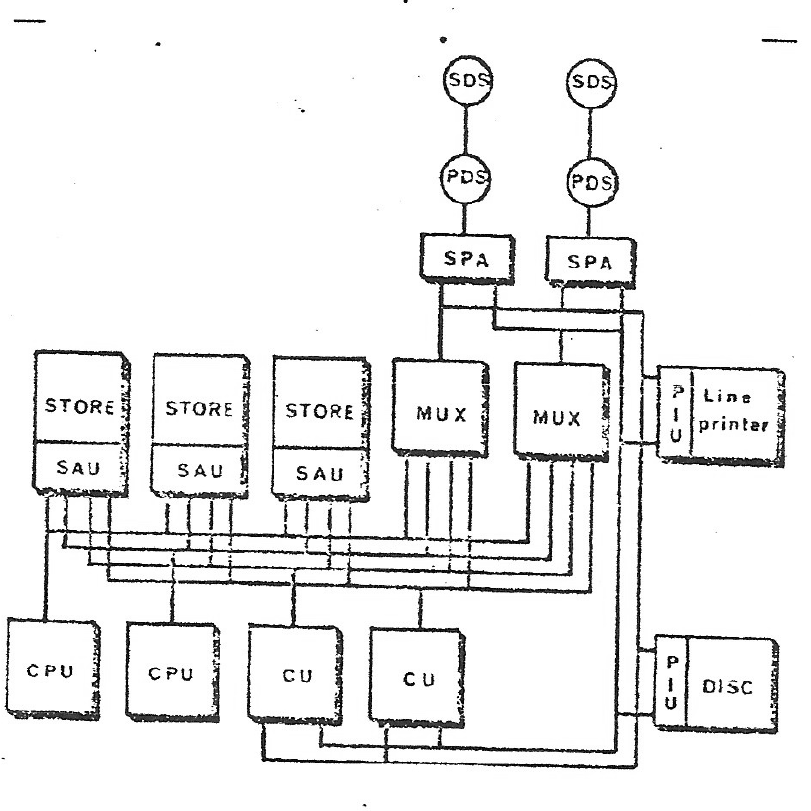
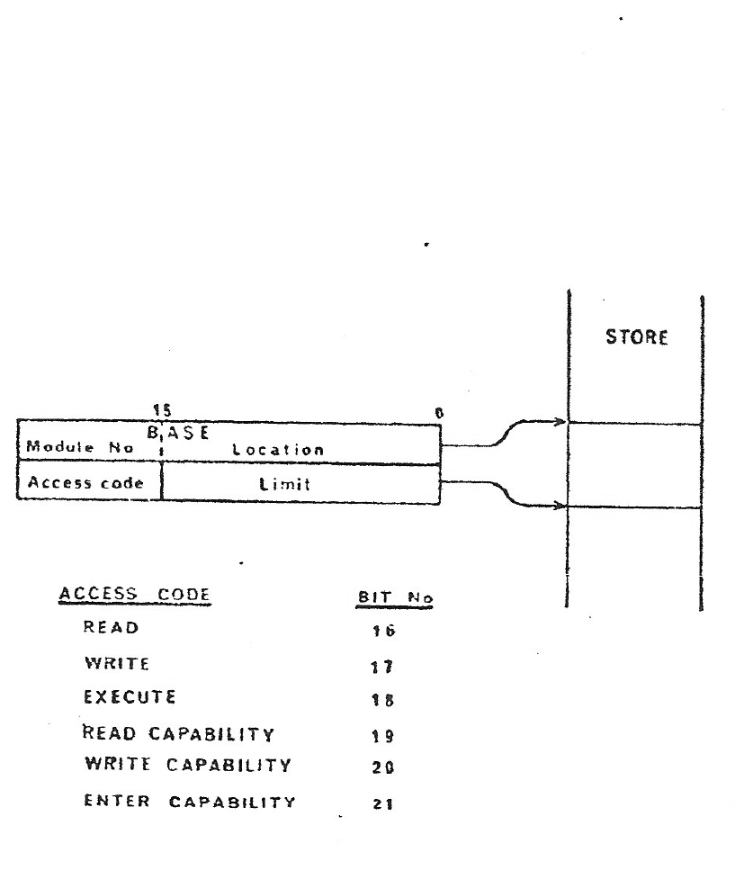
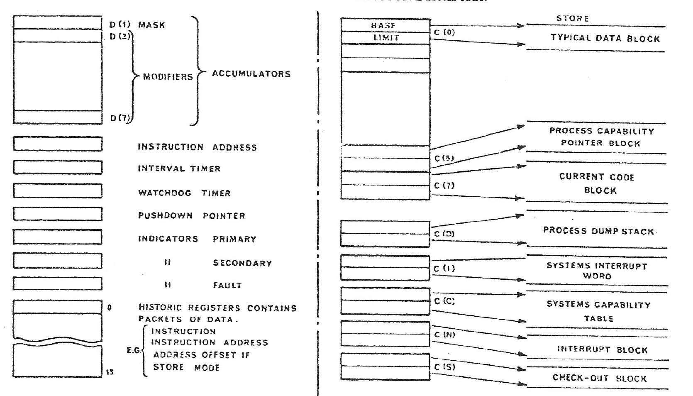
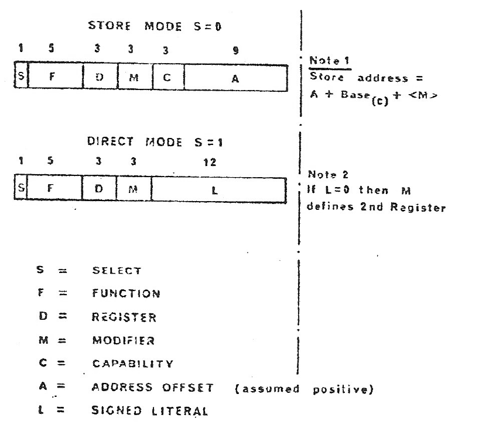
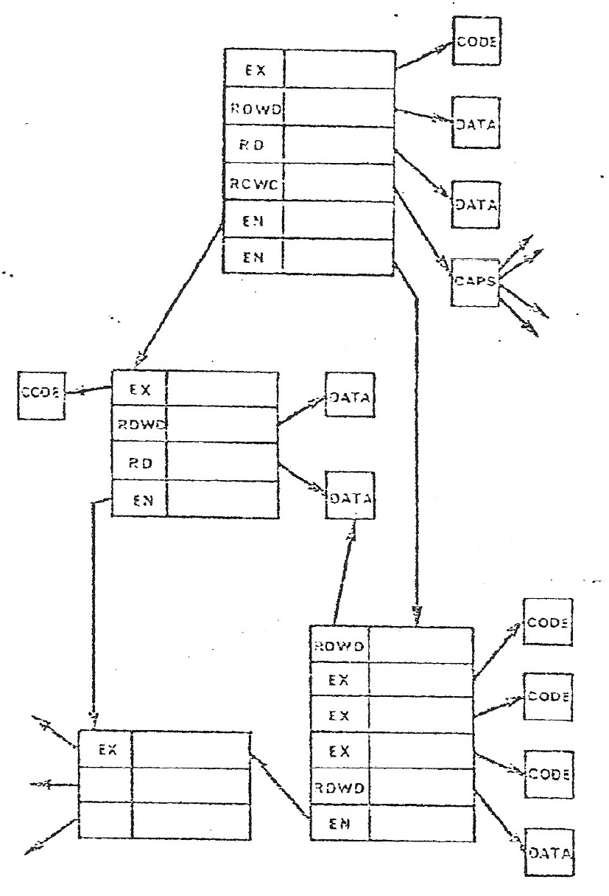
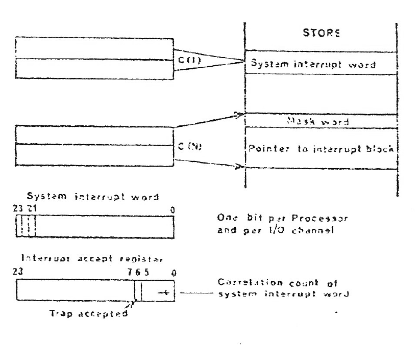
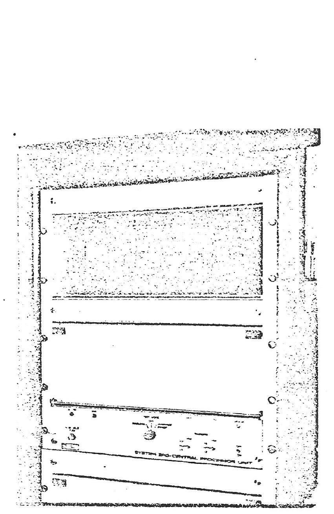
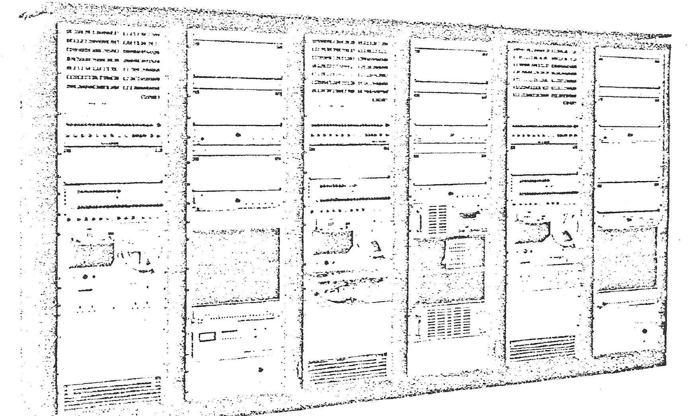

# Hardware of the System 250 for Communication Control

Source: [Hardware of the System 250 - D Halton - 1972.pdf](../documentation/Hardware%20of%20the%20System%20250%20-%20D%20Halton%20-%201972.pdf).

> Working transcription of primary source material. Original wording and technical claims are retained, including apparent source errors. Line-break hyphenation has been removed. Figures are reproduced from the scan; figure descriptions and transcription notes are editorial additions.

**D. Halton**

Plessey Company Ltd. Poole, Dorset, England

## Abstract

The paper describes the implementation of a system designed to meet the requirements discussed in the associated papers. In order to meet the requirements of reliability and flexibility a multi-processor approach was adopted, allowing of modular and independent addition of processing and storage capacity. The main aims for the hardware design have been to achieve reliability utilising the principle of redundancy and to impose minimum restrictions on system and software organisation.

A multi-processor approach, while offering the ability to provide redundant modules in an economic manner, as opposed to full duplication, presents considerable problems in interaction between processors, particularly in a load-sharing mode. To deal with these problems and also to facilitate software organisation, a capability protection concept has been implemented in the system.

## System Configuration

The control of the system and all processing functions are carried out by the Central Processors (CPU), the programs and data being held in the storage modules which are fully distributed i.e., all storage modules can be accessed by all processors. Thus, the functioning of the Central Processor is of major importance in an understanding of the system. Before dealing with the Central Processor in detail however, it is useful to consider the various modules of the system and the ways in which these can be configured. At this stage, the basic functions will be described with more detailed descriptions as appropriate at a later stage.

### Figure 1. Minimal System

*Figure labels/description:* STORE; SAU; Peripheral; PIU; CPU. Two processors and two store modules are connected through separate memory buses.

Figure 1 shows a basic two processor configuration involving two storage modules and simple computer peripherals. The bus connection from the CPU to the Store Access Unit (SAU), known as the memory bus, is provided on a one per CPU basis, and is implemented in balanced drivers and receiver gates, switching about zero. Data is transferred in parallel between CPU's and stores. In this configuration the peripherals are connected directly to the memory buses, via Parallel Interface Units which comprise two sections. These are the bus interface, which is adopted as the system Standard Parallel Interface, and the section which converts the device interface to the Standard Parallel Interface. This method of peripheral connection is shown as an indication of system possibilities rather than a practical example.

### Figure 2. Basic Exchange System

*Figure labels/description:* STORE; SAU; CPU; SPA; PDS; SDS; SIU; SCANNER; DISTRIBUTOR; Teleprinter; Reader.

Figure 2 shows a rather more practical system which involves the basic connections to telephone peripherals. In System 250 the connection of the telephone system, which in computer terms involves a large number of slow-rate peripherals, is effected via a serial data medium, which also handles the slow-rate computer peripherals such as paper tape equipment and teletypes.

The interface between the parallel and the serial medium is effected by the Serial Parallel Adaptor (SPA) which handles data transfers in both directions. The serial medium comprises a number of data switches which can be cascaded to provide the required degree of concentration or diversion. Large numbers of physically distributed devices can be handled by situating a Primary Data Switch (PDS) adjacent to the SPA and Secondary Data Switches (SDS) adjacent to the devices.

The PDS has a 64-way switching capability and the SDS a 16-way capability. The Serial Medium presents a Standard Serial Interface to all switching outlets and each dependent device must therefore have an interface unit which converts from the Standard Serial Interface to the device interface, known as the Serial Interface Unit. In some circumstances the demands of a peripheral device for data transfer may constitute a full load on a CPU so that the CPU is continually involved in control of peripherals. The inefficient use of the CPU is overcome in System 250, as in many conventional systems, by the introduction of a Channel Unit (CU). The Channel Unit is controlled by the system as another peripheral and is set up by the CPU to handle data transfers, thus enabling the CPU to release and carry out other processing tasks. The CU is provided with its own bus to enable transfers to be performed independently of the CPU's. The Channel Unit is thus an active system module, and the provision of multiple register sets enables it to control a number of simultaneous data transfer. The mechanisms which enable the CU to construct and use store addresses for the purposes of data transfer are subject to the same degree of fault detections as those in the CPU, which are to be explained in some detail.

Inherent in the input-output-complex of System 250 is the concept of unified addressing whereby all data sources and destinations in the system are identified by a 24-bit address generated by a CPU. This means that in effect, all sources and destinations in the system are addressed as storage locations and this principle has two important corollaries.

a) The CPU does not require explicit input/output instructions. A ‘read data from peripheral’ operation corresponds to a ‘load data’ instruction which specifies a peripheral register as the source of the transfer rather than a location in store.

b) All transfers of data within the system are controlled by the capability protection mechanism. Thus the allocation and use of peripheral registers can be controlled by the supervisor program using the normal capability mechanism. This eliminates the need for a special executive mode of operation when handling peripherals.

The introduction of the Channel Unit as a further device, requiring its own bus, while improving the utilisation of CPU's, could increase the potential cost of interfacing peripherals onto the bus system. Every peripheral must be accessible to all active devices (CPU's and CU's) and so each PIU would require a multi-port multiplexing function, where the number of ports equipped in a given configuration would be equal to the number of buses present.

Multiplexer module (BM), however, has been designed to concentrate the demands from the active modules onto a single Peripheral Bus, therefore removing the need for a variable port inlet facility on each PIU. The use of the multiplexer thus renders the peripheral device connections insensitive to growth in the form of additional active modules, since the extra buses simply plug into the multiplexer module.

### Figure 3. Typical System Configuration

*Figure labels/description:* Three STORE/SAU modules; two CPU modules; two CU modules; two MUX modules; two SPA/PDS/SDS paths; PIU, Line printer and DISC.

Fig. 3 shows a typical large system configuration involving Channel Unit and Multiplexers. High speed peripheral devices such as disks and drums are interfaced via PIU's to the peripheral bus, which utilises the Standard Parallel Interface; low speed devices and the telephone peripherals are connected via the Serial Medium and appropriate Serial Interface Units. Two multiplexers and hence two peripheral buses are provided to ensure system security in the event of a failure.

To complete the outline system description the storage module and the associated Access Unit should be mentioned. The Store Access Unit is a multi-port device, basically providing 4 ports and expandable in modules of 4 ports. The Store Access Unit (SAU) handles parity generation and checking on store transfers and deals with concurrent demands by processors on the same storage module on a queuing basis. The storage module initially provided is a 32K - 25 bit word plated wire store having a nominal cycle time of 250 nSec. In practice any store module can be utilised provided the interface conforms to the SAU specification.

## The Central Processor Unit

In order to understand the principle of system operation it is necessary to describe the architecture and in particular the method of address construction of the Central Processor Unit. In a paper of this length it is not possible to cover all details of the processor, and the presentation therefore concentrates on the areas which are particular to System 250 and discusses relatively briefly the aspects which conform to conventional computer technology.

To introduce the principles of System 250 it is necessary to consider the concept of capabilities. Capabilities provide a method of addressing, from the central processor unit, to any other system module, in a defined manner which allows of the detection of a fault condition if the definition is violated.

The principle is most easily described in terms of access to main store, although as stated, capability protection is applied to all transfers in System 250. In the system, capabilities are loaded into hardware registers, the capability defining the lower and upper bounds of a block contained within a store module and the mode of access. All addresses are constructed using an address offset in the instruction, added to the base value contained in a capability register defined in the instruction.

The format of the capability register is shown in Figure 4. The register consists of two 25-bit registers, one bit in each register being parity. The access field contains an eight bit linear code which defines the operations permitted on the block defined by the base and limit. Three of the codes READ, WRITE and EXECUTIVE are concerned with operations on data and code, the other three are used for the manipulation of capabilities themselves.

The basic architecture of the machine is shown in Figure 5.

There are eight general data registers D₀-D₇. All eight can be used as accumulators and D₁-D₇ can be used as modifier registers. D₀ can also be used as a mask register which controls marked operation with certain instructions. Each register is 25 bits long, 24 bits + 1 parity bit being the basic word length of System 250.

### Figure 4. Capability Format

*Figure labels/description:* BASE: Module No and Location (location bits 15 to 0); Access code; Limit; STORE. Access-code bits: READ 16, WRITE 17, EXECUTE 18, READ CAPABILITY 19, WRITE CAPABILITY 20, ENTER CAPABILITY 21.

There are eight general purpose capability registers, C₀-C₇, general purpose in this context meaning that the registers are directly accessible to all programs. Each capability register comprises two 25-bit registers. As indicated in the diagram C₇ is allocated to holding to holding the capability for the currently running code block, while C₆ defines the process capability pointer block which designates the capabilities which are available for the currently running code block. The remaining registers are loaded under programmer direction with capabilities for data blocks as required. By definition C₇ will always hold an EXECUTIVE access code.

### Figure 5. Machine Architecture

*Figure labels/description:* Data registers; MASK; MODIFIERS; ACCUMULATORS; INSTRUCTION ADDRESS; INTERVAL TIMER; WATCHDOG TIMER; PUSHDOWN POINTER; INDICATORS PRIMARY, SECONDARY, FAULT; HISTORIC REGISTERS CONTAINS PACKETS OF DATA, e.g. INSTRUCTION, INSTRUCTION ADDRESS, ADDRESS OFFSET IF STORE MODE (0-15). Capability-register labels: BASE, LIMIT, C(0), C(6), C(7), C(D), C(I), C(C), C(N), C(S). Store labels: TYPICAL DATA BLOCK; PROCESS CAPABILITY POINTER BLOCK; CURRENT CODE BLOCK; PROCESS DUMP STACK; SYSTEMS INTERRUPT WORD; SYSTEMS CAPABILITY TABLE; INTERRUPT BLOCK; CHECK-OUT BLOCK.

In addition to the eight general purpose capability registers there are five special capability registers which are used by the processor and the operating system to access control information. These registers are not normally accessible to programmers, but can be accessed by programs which operate in a special internal mode. However, the hardware may allow the contents of a register to change during the execution of certain instructions. For reference the special capability registers are:

C (D) - which defines an area of store called the Process Dump Stack.

C (I) - which defines the System Interrupt Word.

C (C) - which defines the System Capability Table.

C (N) - which defines the normal interrupt block.

C (S) - which defines the start-up block.

### Figure 6. Instruction Format

*Figure labels/description:* STORE MODE S=0: S (1 bit), F (5), D (3), M (3), C (3), A (9). DIRECT MODE S=1: S (1), F (5), D (3), M (3), L (12). Note 1: Store address = A + Base₍C₎ + `<M>`. Note 2: If L=0 then M defines 2nd Register. S = SELECT; F = FUNCTION; D = REGISTER; M = MODIFIER; C = CAPABILITY; A = ADDRESS OFFSET (assumed positive); L = SIGNED LITERAL.

## Instruction Format

The basic instruction formats of System 250 are shown in Fig. 6. There are two formats, known as Store Mode and Direct Mode, determined by the condition of the most significant bit, the S field.

In Store Mode, the address defined by the instruction is used to access a store location which contains the required operand. The F field defines one of 32 functions to be performed. The D field normally selects one of the general purpose data registers D₀ to D₇ to be used as the first register operand of the instruction.

There are two exceptions to this rule. Firstly, in the case of the JUMP instruction, the field is used to indicate one of eight arithmetic conditions. Secondly, two of the capability manipulation instructions use the field to define the capability register on which the operation is to be performed.

The M field selects one of the general data registers D₁ to D₇ to be used as a modifier in forming the address. Zero in this field indicates no modification and therefore D₀ cannot be as a modifier. The C field defines one of the general purpose capability registers C₀ an C₇ the contents of which define the relevant store block. The A field contains a positive binary number used in forming the operand address.

## Address Construction

The address to be used by the instruction in Store Mode is formed by adding the Address Offset in the A field to the base value in the Capability Register defined by the C field. The resultant sum is then added to the contents of the modifier register defined by the M field, this step being omitted if the M field is zero.

Thus, an address is always defined relative to the base of a specified capability register, which in turn defines the store-block currently in use. It will thus be appreciated that the capability concept is an integral part of the processor operation. When When the address is formed, checks are carried out to ensure that the constructed address is valid in terms of the capability definition. The Access Field is first checked for all zeros and if this condition is encountered, a PROGRAM trap is generated. The absolute address is then checked to ensure that the value lies between the base and limit values in the specified capability register. If either check fails a fault interrupt is generated. Finally the micro-program step which determines the form of access is checked to be compatible with the codes defined in the field. Again, if this check fails a fault interrupt is generated. If the checking procedure is successful the required store access is performed by the processor and the contents of the store location form the second operand. When the instruction address register is used as the address-source to access instructions, the same checks are carried out using the contents of capability register C(7).

To appreciate how the capabilities are supplied, it is necessary to consider the ‘enter’ mechanism. ‘Enter’ is one of the available access code types, its purpose being to submit a subroutine call from one code to another, or more strictly a code block in one node to call a code block in another. The method of operation is as follows:

1) The calling node has an enter capability for the main capability block of the called node. An offset down this block gives an execute type capability for the required code block.

2) The call is achieved by a ‘CALL’ instruction, which specifies the enter type capability and offset. The effect of the call instruction is:

i) To load C7 with the execute type capability for the required code block.

ii) To load C6 with the enter type capability for the called node’s capability block. A read capability access code is automatically supplied in C6, so that the called node can read its own capabilities.

3) The old values of C6 and C7 referring to the calling node, are automatically preserved in a stack defined by one of the special capability registers. These values are returned when the called node performs the instruction RETURN. It should be noted that the enter type capability does not violate security rules, a calling node cannot gain access to the data block of a called node by reading them, only the called block can utilise the relevant data blocks. Both calling and called nodes are mutually protected from each other.

## Instructions

The instruction set of System 250 may be considered as, being in two sections + data instructions and capability manipulation instructions. The data instructions are essentially conventional the second set being provided for the necessary manipulation of capabilities described in the paper on system operation.

## System Interrupts

An important aspect of the processor, particularly associated with the handling of input/output transfers is the method of dealing with interrupt.

It is implicit in a traffic-sharing system that any processor is capable of performing any process. It is therefore follows that input/output and interrupt must be processor independent.

In Direct Mode the S bit 1 and no store accesses are involved. Thus, the C field is not required and the C and A fields are combined to form an 11-bit signed literal (L). The literal value can be modified by the contents of the register defined in the M field. If the L field is zero, the M field is used to define one of the registers D₁ to D₇ as containing the second operand, giving register to register operation.

## Capability Structure

Thus a capability register defines the permitted bounds of a store block and the operations upon it which are valid. It is in fact, an access right to store. Any attempt by a program to refer outside these permitted bounds or to perform illicit operations is detected by hardware and the program is interrupted into a fault handler. The capability register thus has two functions:-

1) To provide an addressing base for access to the store.

2) To limit the scope of a program and thus contain its potential for store corruption in the event of a fault.

It should be noted that the protection is equally valid against both hardware and software faults.

The special capability register C₆ already referred to, defines the process capability block, containing blocks that the code may want to operate on. Some of these would be data blocks, some might themselves be capability blocks, giving access rights to a whole new range of blocks. Thus a whole network can be constructed consisting of code and data blocks interconnected by capability blocks as shown in Fig. 8.

Each of the nodes consists of a capability block with satellite code and data blocks, and further satellite capability blocks giving access to further data blocks etc., the whole forming a nodal data structure on which its code blocks can operate. A code block can operate on this structure provided two capabilities are supplied:

1) For the code block itself; in C7

2) For the node’s main capability block, in C6 giving access to all blocks of the node.

This implies a departure from the conventional method of handling interrupts, in that the interrupt signal must produce a system reaction, which can be handled by any processor, rather than being connected to individual processors. Interrupts are therefore handled via the storage system.

All processors and input/output channels have access to a word in store known as the system interrupt word. Each processor references this word by means of the special capability register C(I). Every 100 μs (or any suitable period defined for a given system), the processor automatically stops at the end of the current instruction and carried out a check for interrupt requests. This is illustrated in Fig. 7.

### Figure 8. Capability Network

*Figure labels/description:* Capability blocks containing EX, RDWD, RD, RCWC and EN entries link CODE, DATA and CAPS blocks. The original network connections are retained in the image.

### Figure 7. Interrupt System

*Figure labels/description:* C(I) points to the System interrupt word; C(N) points to Mask word and Pointer to interrupt block. The system interrupt word has one bit per Processor and per I/O channel (bits 23, 21 and 0 marked). The Interrupt accept register marks bits 23, 7, 6, 5 and 0, Trap accepted, and Correlation count of system interrupt word.

Using special capability register C(N) the processor fetches the Interrupt Mask Word. Using special capability register C(I), the processor fetches the System Interrupt Word (SIW) and locks the store module to prevent the processors from performing a simultaneous access. If the SIW is zero, the sequence is terminated. Otherwise, those bits of the SIW for which the corresponding bits in the Mask Word are one, are copied into an internal register. The value in the internal register is then correlated, i.e., a correlation count is produced which defines the position in the SIW of the first effective one, and this count is placed in bits 0-5 of the Interrupt Register, and the selected bit in the internal register is zeroed. The new contents of the internal register are then written back into the SIW location and the store is unlocked. The effect of this operation is to reset the most significant unmasked 1 in the System Interrupt Word and to define its position in the word by placing a correlation count in the Interrupter Register. This count is used by the processor to identify the module generating the interrupt, which may be a processor or an I/O Channel. In effect this means that the System 250 is not interrupt driven in the conventional sense. Input/Output operations are controlled by a polling action from the CPU’s and interrupts are only used for such purposes as indicating the end of a drum or disc transfer, for example.

## Protection Mechanism

In System 250, major reliance is placed on the capability mechanism to detect errors and to provide the basis for software structuring. It is therefore essential that the capability mechanism itself should be secure. Several protection devices are built into the processor to ensure this security.

Loading of capabilities is carried out from a system reference called the System Capability Table. A sum check word is held in the System Capability Table, which is the arithmetic sum of the base and limit values, right circulated by 9 bits. This is used as a check against store faults and corruption of the storage area containing the table.

The circulation of the sumcheck ensures that bit failures on the data paths into the processor will be detected as a sumcheck failure. It should also be noted that any single bit failure in the store addressing mechanism will also generate a fault condition when the System Capability Table is accessed due to the three-word packet arrangement. Capability words are held in store and the registers as 24 bit words and parity. Parity is checked on loading and also whenever a capability register is accessed in normal usage. The circuitry of the capability registers, which are implemented in 16 bit MSI packages is arranged so that any single bit failure will generate a capability violation condition. The normal use of capabilities involves the arithmetic unit so that a valid base limit check confirms correct operation of the arithmetic unit. Parity checking is used on all transfers in the system. When an address is transferred to store the processor begins to generate parity in parallel with this transfer. At the Store Access Unit, parity is also generated and returned on the parity check wire to the processor in parallel with the store access cycle. The parity condition which is odd parity over the 24 bits of the address is held in both the processor and the Store Access Unit. When a data word is transferred to the store the processor again generates parity, over the 25 bits consisting of the data word and the stored address parity bit. A similar process occurs at the Store Access Unit and the generated parity is returned to the processor over the parity check wire and written into the 25th bit of the addressed location.

The state of the parity check wire is compared at the processor with the parity generated locally and if a comparison failure is detected, the fault micro-sequence is entered immediately. The comparison occurs at Address Accept on both READ and WRITE operations and at Data Accept time on WRITE operations. This scheme ensures that parity generation and detection are kept to a minimum and that any single bit failure in the address selection logic in the store is detected.

A number of other detailed checks are included; to ensure for example, the continuity of the capability address highway, but space does not allow a full description.

To summarize, the capability mechanism is protected to ensure correct loading from the correct address to the hardware register, stability of the data during its life in the register and correct operation of the register whenever the capability is accessed.

A brief discussion of the actions which occur when any of the fault detection mechanism are activated is relevant at this point.

When any failure occurs the current process is immediately interrupted and RESET command sent to store. The processor then attempts to run a fault check sequence under the control of special capability register Cₛ, which allows access to a special limited area of store containing the necessary parameters. A special check-out program is used to attempt to confirm the correct operation of the processor. If, during this sequence, a fault is encountered, the number of the module in special capability register C(S) is incremented by 1. Each store module has a special block per processor in corresponding locations, so that the parameters defined by C(S) are now loaded from a new store module and the process is re-attempted. Thus a processor which is in fact faulty can never return to system. On completion of a satisfactory check-out the action taken is system dependent. As a general indication, the processor will inform the supervisor and the supervisor will return the processor to system operation in a controlled manner.

Once the validity of the capability check is secured, the capability offers significant advantages in many areas of the system. Not least of these is the ability to constrain the functions of new modules, in both hardware and software, which are added to the system. The new modules can be tested with no risk of damaging the operation of the existing equipment. Thus the capability concept makes a significant contribution to the problem of expansion of a working system, the solution of which is vital in the telephone exchange environment.

## Machine Construction

The Central Processor Unit and Store Access Unit are constructed using dual in-line IC packages mounted on 4 layer printed circuit boards measuring 190 x 153 mm. The two outer layers carry circuit tracks and the two inner layers are ground and voltage planes respectively. Packages used are predominantly Texas 74H series, but other packages are used in some areas, for example, the capability registers which utilise 16 bit MSI scratch pad packages. Maximum package density per board is 42.

The boards plug into connectors which are mounted in printed circuit backplanes assembled in to a shelf. Each shelf can carry 33 boards. The CPU comprises two shelves, and the SAU one shelf. The backplanes themselves comprise a multilayer construction 12-layer in the case of the CPU and 10-layer in the case of the SAU. The store currently in use is a 32K 25 bit plated wire store having 250 ns cycle time and itself utilises similar construction techniques except that a full PC backplane is not employed. Fig. 9 indicates the assembly. Fig. 10 shows a view of the equipment in a module environment incorporating special test sets.

## Conclusions

While not exhaustive, it is hoped that this paper, in conjunction with the two previous papers, has indicated the principles of the System 250 approach, with its method of dealing with the problems of a multiprocessor environment, which is considered to offer improved facilities over previously available hardware.

## Acknowledgement

I would like to thank the many colleagues on whose work this paper is based and the Directors of the Plessey Company for permission to publish it.

### Figure 9. Central Processor Unit of System 250

*Figure labels/description:* Photograph of the processor cabinet.

### Figure 10. 3-Processor Equipment (also includes experimental test equipment)

*Figure labels/description:* Photograph of the equipment installation.

## Transcription notes

- Original section order is retained, including the Direct Mode paragraph under “System Interrupts” and the later continuation of the interrupt discussion under “Capability Structure”.
- “EXECUTIVE” is printed in the body where the figure labels use “EXECUTE”; these readings are retained.
- The Direct Mode paragraph says “11-bit signed literal”; Figure 6 gives the L field a width of 12. Neither has been silently changed.
- Source repetitions such as “holding to holding” and “When When”, and the phrase “C₀ an C₇”, are retained.
