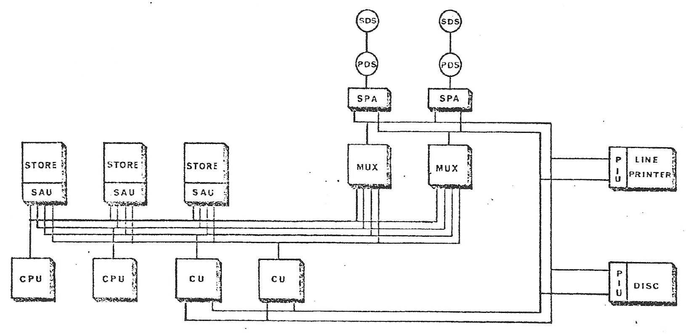
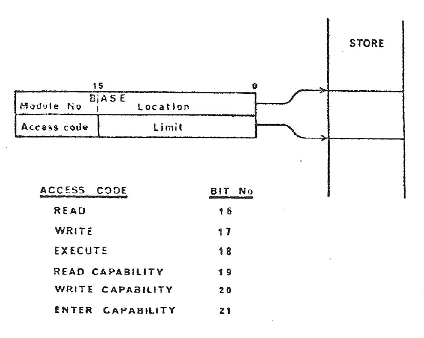

# The Operational Requirements for Future Communications Control Processors

Source: [Th Operational Requirements for Future - J M Cotton - 1972.pdf](../documentation/Th%20Operational%20Requirements%20for%20Future%20-%20J%20M%20Cotton%20-%201972.pdf).

> Working transcription of primary source material. Original wording and technical claims are retained, including apparent source errors. Line-break hyphenation has been removed. Figures are reproduced from the scan; figure descriptions and transcription notes are editorial additions.

**J. M. Cotton**

Plessey Company Ltd. Taplow Court, Maidenhead, Berks, England.

## Abstract

The future communications control problem will encompass not only the control of individual systems but also the control of remote switching systems, over data links, from a central location. In view of the evolutionary nature of Telecommunication networks, it is necessary to provide for both local and remote control with the same equipment. Additionally, it should be possible to control simultaneously, or with the same type of equipment, message switching systems, and other real time control applications.

These requirements along with considerations of software reliability point to the necessity of preventing undesirable interaction between the various tasks of what is, in effect, a complex real time system.

This paper presents the operational requirements of such a control system, and deduces the necessary system features. Accompanying papers describe the software structures implicit in this approach and the hardware designs both for the control equipment and for the compatible new telephony system.

## 1. General

Before considering the requirements for the control system, based on Stored Program Processors, suitable for future communications networks, it is important to be clear what potential advantages might be gained from the use of such a control system. These may be listed as follows:

a) The control functions in an exchange or network would be entirely separate from the switching, signalling and transmission functions and each could develop separately without impact on the other.

b) Ideally the logic functions normally distributed throughout switching equipment, relay sets, markers etc. would be replaced by computer instructions executed in accordance with a program. A change of facility, demanding a rearrangement and redesign of logic and hardware in a conventional exchange which makes retrospective modification expensive could be provided by program change or replacement in an SPC system.

c) Economies could be made in the design of the switching system, since control would have an overall view of the traffic pattern and could organise connections on a dynamic basis.

d) Very fast call set-up times could be achieved, limited only by the operating response of the switching elements. As a result an SPC network could have better revenue earning characteristics.

e) There need be no significant differences between exchanges at different levels in a hierarchy except size and traffic handling capacity.

f) Inter exchange communications could be organised via data channels thus removing the need for expensive signalling relay sets, and freeing the speech paths from any constraint imposed by in-band signaling.

g) Statistical information relating to system performance, network limitations etc., would be readily available as a by-product of Processor Control.

h) Reorganisation of routing strategies could be permitted to avoid traffic restrictions due to cable breakdown, switch block blocking etc. This reorganisation might be automatically executed in program or might be initiated by some manual input from a network management centre.

i) The control equipment should require less maintenance and would be able to provide more comprehensive diagnostic assistance for such maintenance as is required.

j) New switching technologies which may be developed in the future should be more easily accommodated when the control function is separated and provided by computer programs.

## 2. Administration policies

It is well recognised that for any communications system the complete failure of the control system is catastrophic; hence it is undesirable for the control to have a probability of failure higher than once in 50 years or more depending on the number of subscribers served. In order to achieve this degree of reliability with present day components it is necessary to organise the control processing system with adequate redundancy and facilities for control reconfiguration. In consequence the minimum viable control system is relatively expensive, and there is a minimum number of subscribers which may be economically served which is variously quoted as between 2000 and 5000 telephone lines. Such an installation should be capable of handling 10,000 lines with no further control equipment. Hence, the approach which may be taken by an administration to the installation of “Stored Program Control” (SPC) systems will depend on the existing network circumstances and its financial policy.

If the nation concerned is relatively undeveloped with little existing communication equipment, then the only hindrance to its being able to take full advantage of the flexibility and evolutionary possibilities of SPC may be doubts about the economics of the initial installation. Such doubts might well be removed if the equipment were capable of controlling several exchanges in an area, or a number of different communication services simultaneously (e.g. telephony and message switching) or if the administration could make use of the spare processing capacity for data processing purposes of varying kinds.

If, however, the nation already has large quantities of existing electro-mechanical equipment installed at various stages in its useful life, then its problems are more severe. The three obvious policies which it may take can be summarised as renewal/extension, replacement and overlay. These are discussed below.

a) Renewal/Extension: If the Administration follows a policy of only renewing with SPC those installations which have reached the end of their life and providing SPC extensions where they are of sufficient size to be economic, then many decades will pass before SPC makes any significant penetration in the network and the facility and service benefits become apparent. This will be particularly true of some of the benefits (d, f and h above) which only become apparent when there is a high penetration.

b) Replacement: Under this policy exchanges which require extension are completely replaced by the new system. The size of the new installation will thus usually be big enough for the SPC to be economic. The drawback is that large capital investment is required.

c) Overlay: Under this policy the administration will plan to incorporate the modern equipment in an “overlay” network, separate from but interfacing with the old equipment at suitable points and to interconnect the overlay portions of exchanges in a network divorced from the existing network, and only connected to it at strategic points. An exchange growth treated in this manner, may continue to expand to meet growth at the requisite planning periods until it serves the major portion of the telephone service area concerned. At some stage when economic, the old equipment is removed and the total exchange load is now handled by the modern equipment.

It is inevitable that in the overlay principle with the modern equipment being provided to satisfy growth, it will be provisioned in smaller sizes than would be the case with complete exchange replacements, e.g. suppose it is required to extend an 8,000 line telephone exchange with a projected annual growth of 5% and the planning period is 5 years. Then the modern equipment to be installed will provide for an ultimate of 2,200 lines at the 5 year date. This may well not be economic, and smaller installations would certainly not be economic because of the cost of the individual control systems.

An alternative approach is to aggregate the growth of a number of exchanges within an area, say a G.S.C. area and control the equipment provided to switch growth traffic at each of the individual exchanges from a common central processor installation. Then if there are say 10 exchanges within the area with an average 5 year growth of 1,000 lines per exchange, the SPC installation is now economic - there are of course some additional charges to be borne in this case for the provision of data links and associated equipment.

## 3. Network based on SPC control centres

It has been shown that to apply SPC to the growth elements of an existing network using an overlay concept is only likely to be economic if a control centre is provided, having facilities for controlling the growth equipment of a number of exchanges in the area. Sufficient work has been done to indicate that even if an Administration adopted a policy of replacing existing exchanges with SPC, the technique of controlling the area from a central processor would still be the preferred choice. The basic reasons for preferring area control are:

(i) It ensures that the control complex is worked at a reasonable level of efficiency.

(ii) Because of centralised control it is possible to “map” the switch-blocks and interexchange connection circuits for a whole area. In the case of the switchblocks the use of a central map permits switchblock design to be optimised in terms of cost.

(iii) The ability of a processor to select an “overall path” for a within area call improves network efficiency since a call from a subscriber on exchange A to one on exchange B (either direct or via exchange C) is only set up if links are available and the “B” subscriber's line is free. Thus the revenue earning power of a given network is improved.

(iv) The location of processors in a central situation is more conducive to efficient maintenance. The central processor armed with efficient diagnostic programs can identify faults perhaps down to plug-in card level and provide a print-out of the fault and diagnosis. From the centre a maintenance officer can be despatched to the fault location equipped with the necessary replacement unit.

(v) Management of a network is more readily achieved in terms of alternative routing strategies designed to “route around”: fault equipment or junctions.

(vi) Day to day administration of a network eg. disconnection of service for ceased lines or non-payment of rental, changes in class of service etc. can be achieved from central control.

(vii) The gathering of management statistics on traffic, call holding time, call distribution by destination, levels of successful calls etc. are readily available with the appropriate programs.

(viii) Inter-processor communication is only required on those calls entering or leaving the area.

(ix) The improved facilities and service offered by SPC achieve a wider and faster penetration.

(x) P.A.X. and P.A.B.X. equipments within the area may also be controlled remotely by the central processor equipment.

## 4. System concept

Ideally to meet the requirements of an evolving network either of an overlay nature or by exchange replacement, the new telephony system should possess two important properties. These are:

- Flexibility
- Ability to evolve

The requirement for flexibility arises from:-

(i) variations in size for different environments in terms of subscribers and traffic.

(ii) variations in facility requirements in different environments.

(iii) the need for the system to exist in many varying configurations i.e. main exchanges: group switching centres; overlay Network switching nodes etc.

The requirement for the ability to evolve arises from:- (i) qualitative changes in the network due to the introduction of new services and facilities.

(ii) the rapid advances in technology.

From these requirements the following general principles can be defined which could lead to an attractive system framework:-

a) General purpose approach to the provision of equipment; which allows both flexibility and evolution.

b) Open-endedness of organisation; allowing unrestricted growth.

c) Recognition of natural distinctions within the system such that the distinct parts can develop separately with the advent of new needs and means.

d) Modularity, both in hardware and software, which will provide flexibility of application.

These principles will be followed by division of the total system into sub-systems which are functional entities rather than physical entities. A subsystem is thus implemented as a modular combination of hardware and software which is functionally complete such that any change to the sub-system is contained within itself and should not necessitate associated changes in other subsystems.

A sub-system is defined by means of its functional interfaces with the rest of the system. The definition thus includes both the hardware and software interfaces which envelop the sub-system. Complete freedom of design and evolution and varying hardware/software boundaries are possible within the sub-system interface envelope. The rest of this paper is concerned with the control sub-system, which, in the network control situation might be thought of as a processor utility since it could be used to control telephony sub-systems of successive equipment generation and designed by different manufacturers, as well as other communications sub-systems such as data networks, telex and message switching. The telephony sub-systems are discussed in a companion paper.

## 5. System constraints

The constraints which are imposed on the design of a processor complex for it to be suitable as the exchange control or network Control Centre (CC) in the future communications network as described above, may be listed and discussed as follows:-

(i) Continuity of Service is required for all the exchanges in the network with no service interruption allowed during expansion of hardware or facilities. This is even more important if a Control Centre is supplying the control for all the exchanges in an area. Continuity of service is also required despite the failure of portions of the control system so that on a probabilistic basis its mean time between failures must be between 40-325 years (dependant on amount of equipment controlled) in the face of both transient or permanent hardware failure and the inevitable existence of software errors.

Such service continuity cannot rely on manual intervention since the control equipment may spend long periods unattended.

(ii) Expansion of the number of subscribers in an area is presently at 6% p.a. in the UK.

If an overlay technique were followed then the increased traffic only would be taken by the Control Centre. Assume the initial CC installation is economically justified in an exchange or an area to cover the first five year expansion, then the next 25 years will bring a 13 : 1 expansion in the number of subscribers served by the CC which will will represent an even greater increase in traffic. If during this period the original outdated electromechanical equipment is also replaced then the CC traffic will be increased by a factor greater than 16: 1. It is unlikely that an economic initial CC installation will be able to expand its load by more more than 4 : 1 without increase in the number or power of the processors. Thus the CC must be capable of at least 3 : 1 expansion in power during its life, and such an increase in processor power should not necessitate reprogramming of the system. For area control the CC must also cope with evolution of both the network and the CC itself during this period as a result of the introduction of more advanced technologies, and evolution and increase in number of the facilities to be offered to the subscriber.

(iii) Network Control by the CC requires that some of the very large number of low activity peripherals which form the exchange equipment will be controlled remotely over data links at the same time as the CC is in direct control of colocated equipment. The network will (in the UK at least) consist of telephony sub-systems designed and programmed by different manufacturers, as well as the administration itself. The CC hardware and associated operating system must therefore be able to support many different interacting software sub-systems written by different teams at different times throughout its life and with varying degrees of competence. Also it will probably be required in the future to support simultaneously other tasks which must not interact with the telephony task.

## 6. Requirements

From the foregoing discussions it is possible to extract the essential operational requirements which will influence the design of a suitable processor complex for a Control Centre for either network or individual exchange control. These may be considered under the following six headings:- modularity, continuity, expansion, evolution, isolation and automatic recovery.

(i) Modularity of the equipment is necessary to allow economic provision of redundancy for system reliability, and expansion as nearly graduated to enhanced requirements as is economic.

(ii) Service Continuity of the P.U. must be maintained for the life of the system with a statistically probable mean time to system failure from all causes of 50 years or longer. The continuity must be maintained despite the addition, subtraction, modification or evolution or maintenance of both hardware and software modules. Acceptable degrees of degradation as a result of partial system failure must be specified by the administration.

**(iii) Expansion** of the Control Centre equipment has been shown to be necessary by a factor of 3 or more during its life time. This brings an important requirement for an adequate addressing range for the maximum size of control area envisaged for both peripherals and storage.

The second requirement is that addition of storage or processing power should not demand any alteration of programs.

**(iv) Evolution** of both the hardware and software of the CC must be expected during the life time of the system, which hopefully will be 25 years upwards. The hardware will need to evolve to take advantage of improved technology and provide new or improved resources whilst the software will evolve to provide new application facilities, and new operating system facilities and control of new resources. The need for software evolution points to the requirement for system features to allow subsequent on-line modification of the operating system and application programs. Such modification will almost certainly be under-taken by other than the original design staff.

**(v) Isolation** of the various software sub-systems is a requirement to provide adequate ensurance that:-

a) Sub-systems (or users are prevented from corrupting or illegally accessing the resources of other sub-systems.

b) Sub-systems are prevented from corrupting or illegally accessing the resources of the Control Centre.

The isolation is particularly important in the area control case where sub-systems of differing purpose, design generation and manufacturer must be co-ordinated. Such isolation must, however, be controllable to allow necessary and defined interaction between the various sub-systems and between each sub-system and the CC operating system.

**(vi) Automatic Recovery** from the effects of any type of hardware or software malfunction must be designed into the system. Software is vulnerable to corruption by hardware or software failures. Hence, the software faults and hardware failures should be detected, not necessary as soon as they occur, but before they can corrupt any other sub-system. Mechanisms must be provided to automatically isolate a suspected fault sub-system from the system until it is no longer considered suspect or has been repaired.

## 7. Design objectives

The general requirements, discussed so far, for the control system either for a single exchange or for an area Control Centre have been interpreted into the design objectives of the System 250. These are discussed below:-

a) Since the requirements for increased processing power and store in general do not occur simultaneously, it has been an objective to have these separately expandable in what is known as a multi-processor organisation. The most economic form of redundancy is n + m where n is the number of modules for the task and m is the spare spares to allow automatic recovery in the face of module failure. It is desirable that n > m ≥ 1.

It is also desirable that the modules be small since the M.T.B.F. of a module is proportional to its size or complexity and its M.T.T.R. is inversely proportional to its size - both effects improving the mean time to system failure for any given value of equipment.

b) The requirement that addition of storage or processing power should not demand any alteration of programs, reinforced by the n + m redundancy philosophy leads to the objective that the processors should not be dedicated to any particular task but should be capable of being regarded as part of the system resources. This brings the important corollaries that control of the following activities must be dedicated to any particular processor but must be considered as system functions.

- System timing
- scheduling
- I/O handling
- interrupts

It is also important that all code should be reentrant so that so that processing power may truly be regarded as a resource allocatable as the situation demands.

c) To facilitate hardware evolution it is an important objective that the various interfaces between hardware modules should be as few and as simple as possible.

d) To facilitate software evolution and to improve the ability of the system to provide service continuity despite the inevitable software bugs it has been an objective to take software isolation down to a much finer structure than the sub-system level. Each code block or sub-routine must have isolation against interference from other code blocks.

e) Such isolation together with the requirements for expansion without software alteration, and reconfiguration in the face of store faults leads to the objective of flexible and fully relocatable storage partitioning and allocation. It would also be most desirable to provide the level of software abstraction which allows each sub-system to believe it is the only occupant of the system.

f) As a corrollary of objective b) it has been an important objective to provide a high degree of fault detection in hardware so that each processor in the system will detect its own faults.

Having detected a fault it should have hardware facilities for removing itself from the system and applying self-checking until either it finds itself fault free (in the case of transients, software faults or store faults) or it is repaired.

g) Since the mean time to system failure is inversely dependent on the time to repair it has been an objective to provide facilities for a good processor to be used to diagnose faults in another processor.

### Figure 1. Typical system configuration

*Figure labels/description:* Three STORE/SAU modules; two CPU modules; two CU modules; two MUX modules; two SPA/PDS/SDS paths; PIU interfaces for LINE PRINTER and DISC.

## 8. System realisation

The System 250, which is described in detail in accompanying papers, is the system which realises all the objectives and meets the requirements discussed above. It is fully modular with simple interfaces as will be appreciated from the typical system organisation shown in fig. 1. It is possible to add storage or processing power independently without need for software alteration, and the additions may be made to an operational system without disturbance to service.

The key to the ability to isolate software modules and detect both hardware and software errors whilst preventing their effects from corrupting the remainder of the system has been the use of Capabilities. The original concept came from Van Horn (ref. 1) but in System 250 they have been realised in hardware. Fundamentally a capability defines a system resource, the most easily understood examples being a store block or a subroutine.

Fig. 2 shows that the position of the store block is defined by base and limit values whilst the permitted use of the block is defined by the access field. Such a capability may be the exclusive property of a process but if desired the owning process may allow other processes to have the same or more restricted access to the resource defined by the capability.

By means of such capabilities it is possible to run many entirely independent jobs on the same system, with complete control of the isolation or desired interaction of the jobs.

By these means it is possible to test undebugged software on a live system without fear of system collapse. Thus it becomes feasible to use the same control system to simultaneously control telephony, message switching and telex without fear of undesired interaction, and if desired, run background batch processing as well.

## Acknowledgement

I would like to thank the many colleagues on whose work this paper is based and the Directors of the Plessey Company for permission to publish it.

### Figure 2. Capability format

*Figure labels/description:* BASE: Module No and Location (location bits 15 to 0); Access code and Limit; STORE. The base and limit delimit the store block.

| Access code | Bit No |
| --- | --- |
| READ | 16 |
| WRITE | 17 |
| EXECUTE | 18 |
| READ CAPABILITY | 19 |
| WRITE CAPABILITY | 20 |
| ENTER CAPABILITY | 21 |

## Reference 1)

Dennis J.B. - Van Horn E.C. (1966) Programming Semantics For Multi Programmed Computations. Comm. of the ACM, Volume 9, Page 143.

## Transcription notes

- Section 5(ii) repeats “will” and “more than”; these repetitions are present in the source.
- Section 7(a) prints “spare spares” and the statements about proportionality of M.T.B.F. and M.T.T.R. as transcribed; no technical correction has been made.
- Section 7(b) prints “must be dedicated to any particular processor”, despite its surrounding discussion, and repeats “so that”. These readings are preserved.
