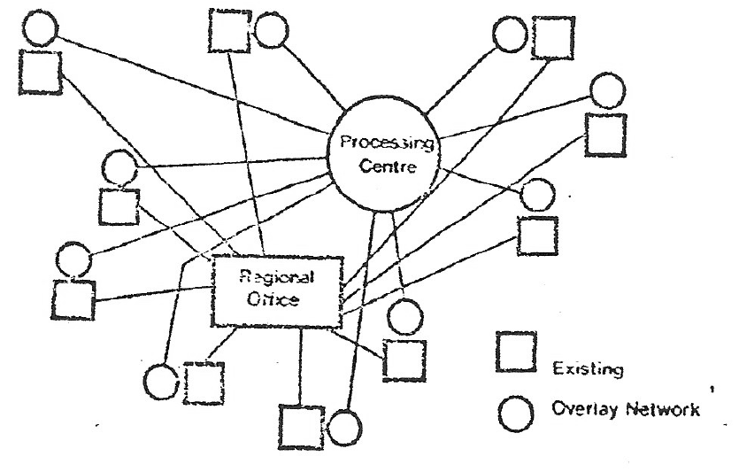
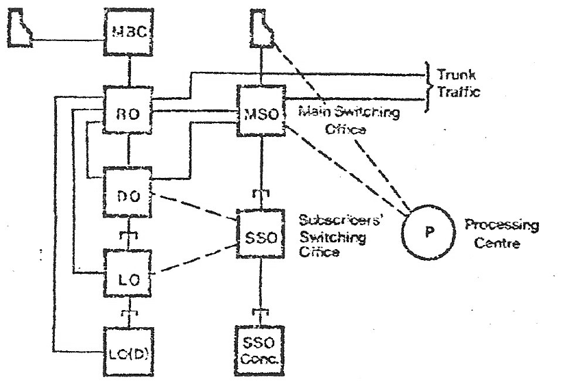
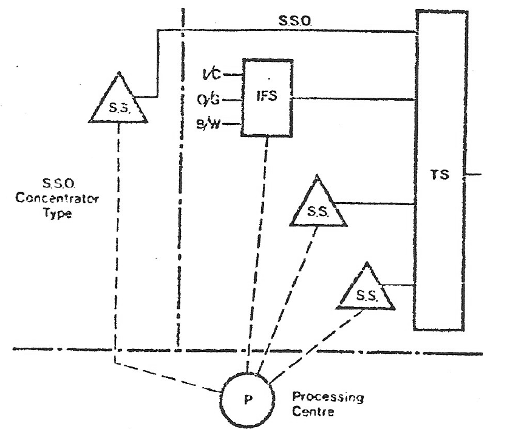
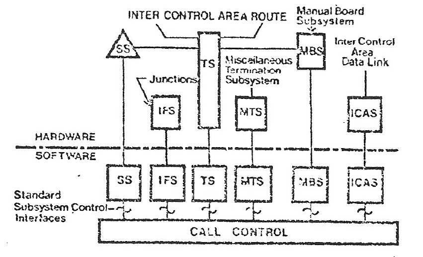
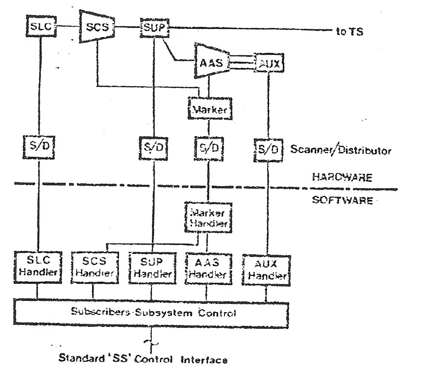
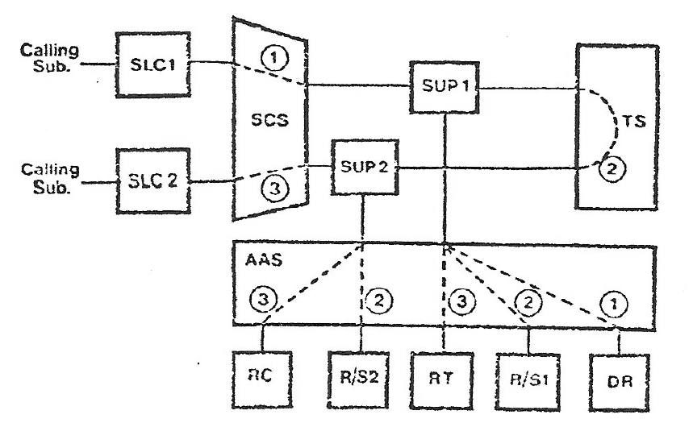
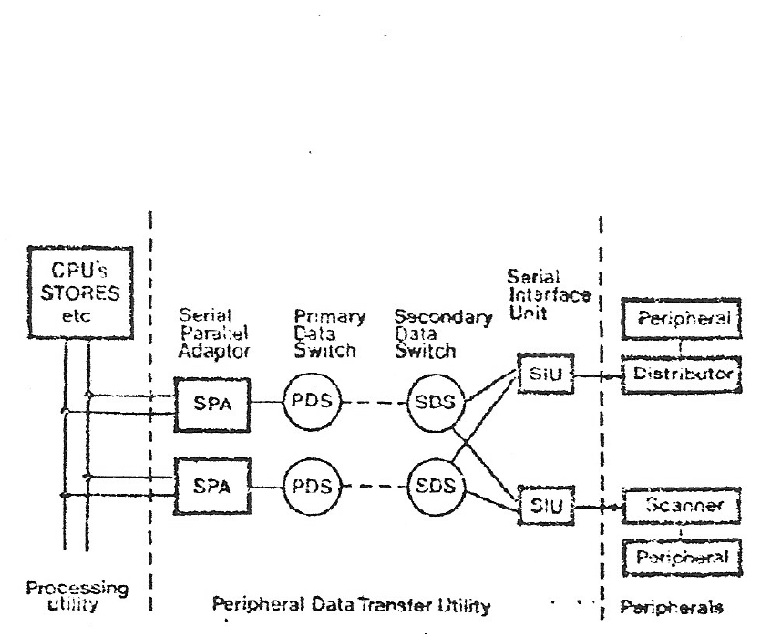
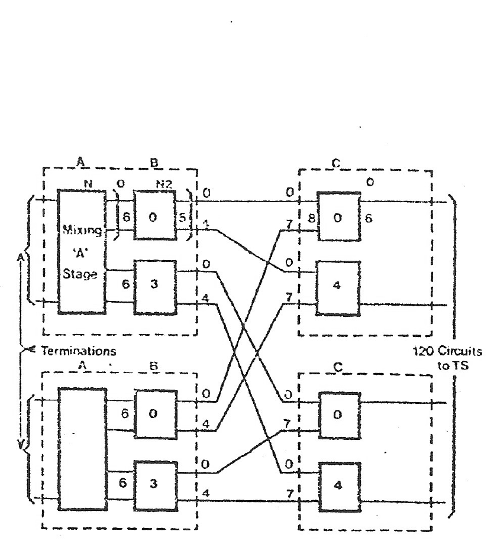

# Telephone Switching Based on System 250

Source: [Telephone Switching based on System 250 - W A C Hemmings .pdf](../documentation/Telephone%20Switching%20based%20on%20System%20250%20-%20W%20A%20C%20Hemmings%20.pdf).

> Working transcription of primary source material. Original wording and technical claims are retained, including apparent source errors. Line-break hyphenation has been removed. Figures are reproduced from the scan; figure descriptions and transcription notes are editorial additions.

**W. A. C. Hemmings**

Plessey Company Limited, Liverpool, England.

## Abstract

Companion papers describe the requirements of a communications control system and give details of the hardware and software of System 250 for this application. This paper shows how System 250 is applied to telephone switching.

The telephone system so organised is modular and is capable of assembly to produce offices of various types and sizes. Whilst initially only autonomous offices may be needed, the system can grow to form networks based on the concept of a processing centre controlling a number of switching units, some or all of which may be remote from the processing centre.

## 1. The Overlay Concept

This paper is based on the “Overlay” and Network Control concepts described in a companion paper and being considered for the continued development of networks such as that of the British Post Office (B.P.O.). These concepts cover all requirements from autonomous offices to full network control by Processing Centres.

It is proposed that the new network might be superimposed on the existing network, all new demands for service being met from the new network. Figure 1 shows the existing network indicated by the squares; the smaller squares are individual exchanges and they are shown linked star fashion to a Regional Office. The circles represent the new network, the smaller ones being remote units operated via data links to the Processing Centre. The main connection between the two networks is shown between the Regional Office (R.O.) and the Processing Centre. It is possible to have interconnections at a lower level than the R.O.: this would depend upon the local community of interest. Such an arrangement has several advantages over other methods of working and these are described in a companion paper.

### 1.(a) Implementation of the Overlay Concept

In order to implement the ‘overlay’ concept, we are developing a series of modular units from which the system is built, each of the modular units being themselves built from a number of standardised sub-systems.

Figure 2 shows a typical existing hierarchical structure comprising Regional Office, district offices, Local Offices etc. side by side with the new equipment. Three units are shown, the Main Switching Office (M.S.O.), Subscriber Switching Office (S.S.O.) and S.S.O. Concentrator. The MSO combines the features of the District Office and the Manual Board together with transit facilities normally available at a District Office. The SSO is the equivalent of a District or Local Office and can operate in a similar manner. The SSO concentrator is really a remote switching unit based on a parent SSO.

These Switching Units are controlled by the processing centre P1, the various units being coupled to the processing centre by control data links. The units controlled by a single processing centre together with the processing centre itself can for convenience be called a control area.

The processing centres of all control areas are able to interwork by means of an inter-processing centre. data link system.

### 1.(b) Sub-systems

Figure 3 shows the component parts of the two S.S.O. shown in the previous diagram. These component parts are standard sub-systems and all switching units can be assembled from a relatively few types of the standard sub-systems. The following sub-systems are shown:

1. Subscribers Sub-System (SS) whose main function is to handle all subscriber activities such as calling line detection, ringing, supervision and so on.

2. Transit Sub-System (TS) which provides a low loss interconnection point for all the traffic offered to it.

3. Interface Sub-System (IFS) which provides a complete signalling and switching interface between junctions to and from the existing network.

These sub-systems are partly hardware and partly software; the sub-division is illustrated in Figure 4. The upper half of the diagram shows the hardware which performs the physical connections and functions. The lower half indicates the software part that resides in the control complex; also shown is a software activity named ‘call control’ which handles the software packages associated with each sub-system via standard sub-system control interfaces.

The hardware of each sub-system comprises many items which are interconnected, and each of these devices is controlled in software by a ‘handler’ package. Some devices such as markers or auxiliary circuits may be common to more than one sub-system. In these cases the complete function (hardware & software) is ‘loaned’ on a temporary basis to the sub-system requiring service. The allocation of auxiliary circuits is such that the sub-system does not know if the service it gets is exclusive or shared.

Figure 5 shows the Subscriber Sub-System divided into its component parts:-

(i) Subscriber line circuits and handler (SLC) — Subscriber calling condition

(ii) Subscriber Concentrator Switch (SCS). This is a three stage reed relay space switch catering for a maximum of about 80 erlangs of bothway subscriber traffic. It is controlled by a marker and its marker handler both of which are in turn controlled by the subscriber concentrator switch handler, whose function is to operate on a software map which contains a record of the complete state of the switch. This map-in-software technique will be mentioned again later.

(iii) Supervisory relay sets (SUP) are provided at the interface to the Transit Sub-System; their function is to detect subscriber cleardown signals and to isolate the DC requirement of the subscribers’ lines from the rest of the system. It also provides an access point for auxiliary circuits. Auxiliary circuits are associated with supervisory relay sets via an Auxiliary Access Switch (AAS) which may be controlled by the same marker as the SCS: the marker in this case is controlled by the AAS handler using the map-in-software techniques already mentioned.

The auxiliary circuits required for the subscriber subsystem include the following:

(i) Digit receivers.

(ii) Tone senders for Ring Tone, Busy Tone etc.

(iii) Ringing current senders.

(iv) Coin control devices for controlling pay station calls.

(v) Transmission test tone sender/receiver for testing transmission paths prior to switching through.

All the above auxiliary circuits and their handlers are controlled by the S.S. control which in turn is controlled by call control. The Interface Sub-System, which is generally similar in concept to the Subscribers Sub-System, is designed to interwork with all types of junctions with which the new and existing network will be interconnected. Auxiliary circuits, such as Senders and Receivers, will depend upon the signalling conditions required.

The Transit Sub-System is, as mentioned earlier, simple in concept and comprises either a software controlled analogue switch or a software controlled digital switch, capable of interconnecting other sub-systems. Software control again uses the map-in-software technique. Different switch designs will be necessary to cater for the various situations where the transit sub-system will be employed within the network.

### 1.(c) Call set up through Sub-Systems

Figure 6 depicts a typical subscriber-to-subscriber call progressing through the sub-systems so far mentioned.

a) SLC1 detects a calling condition.

b) Path 1 is set via SUP1 and AAS to DR. DR returns dial tone and collects digits.

c) If the called subscriber is not busy, path 2 is set from R/S1 via SUP1, TS, SUP2 to R/S2. A test tone is then sent in each direction in turn to prove the path.

d) Path 3 is then set giving ring current to the called subscriber and ring tone to the calling subscriber.

e) When answer is detected by RC, the speech path is completed through SUP1 and SUP2, all auxiliary devices being released progressively as their tasks are completed.

f) SUP1 and SUP2 detect their respective subscribers clearing and terminate the call.

## 2. The Processing Complex and the Processor Utility

The processing complex is the Communication Control System 250 described in companion papers. As far as the design of the telephone switching modules are concerned, the processing complex has been regarded as a ‘utility’ in which we need to consider only what it does, rather than how it does it. Such a ‘processor utility’ forms a secure and defined environment in which application processes may run.

### 2.(a) Peripheral Data Transfer Utility (See Fig. 7)

The medium for the transfer of serial data is a two stage data switch. The primary stage, which is associated with the processor utility, has up to 64 ports with balanced line drivers for distribution within an exchange. The secondary switch is associated with the periphery and has a present maximum of 16 ports and unbalanced drivers. On outgoing messages each switching stage uses part of the address section of the message to select its output port. Similarly on incoming messages each stage appends its port address.

To check the messages outgoing from the processor utility an identifying check code is wired into each peripheral connected to the serial medium; this check code is transmitted with each message intended for the peripheral. Comparison of the received check code with the allocated code at each peripheral confirms that the message has arrived at the correct destination.

The check code is also added to incoming messages as a further check on the integrity of the data transfer arrangements: all paths between the processor utility and the peripherals are duplicated. The whole of the data transfer arrangements is regarded as a further ‘utility’, referred to as the Peripheral Data Transfer Utility.

### 2.(b) Scanners and Distributors

Beyond the secondary data switch, which is associated with the peripheral, are scanners and distributors for data collection and distribution. Two modes of reporting from the scanners are used: exception mode in which a report is made only when an input has changed, or response mode which reports on command. This method of working considerably reduces the number of reports, compared with a scanning technique in which the state of each input is reported on every scanning cycle. In order to simplify scanner hardware and to preserve a standard message format, it is arranged that when a message needs to be sent, the report will consist of a complete scan field and not an individual input. A standard design has been produced which caters for both modes of scanning with minimal hardware and software changes.

The basic function of the distributor is to convert serial data arriving in messages from control to a staticised parallel format to drive peripheral devices. Check codes are used to check the integrity of messages; an incorrect check code causes the distributor to ignor all further information.

Normally, security is achieved in both the scanners and distributors by including these functions in security blocks, that is sections of equipment within which a failure would have only a limited effect on system performance. However, in case of the scanners, duplication or N+1 security techniques can be used where advantageous, such as in the case of small offices.

### 2.(c) Line Circuit & Switchblock

The subscribers line circuit, not illustrated, has an electronic loop detector and uses a reed relay to isolate the loop detector so as to reduce crosstalk and give better testing facilities.

Figure 8 shows the subscribers’ concentrator switch which consists of three linked stages A, B and C using reed relay matrices. To cater for various subscriber calling rates, three methods of adjusting the concentration ratio are provided:-

(i) Varying the multiple of A units on the A-B links.

(ii) Varying the number of AB networks on the BC links.

(iii) Sub-equipping the A units.

The present design represents an optimum between crosspoint minimisation, ease of extension, production costs and maintainability and has been confirmed by computer simulation techniques.

### 2.(d) Marker

The switch network is controlled by a marker, a hardware device controlled by a software marker handler within the processor utility. The current state of the network is contained within a software ‘map’. Information in the map is used to effect path choice and appropriate instructions are passed to the marker via the marker handler in order to set up the chosen path.

The marker operates in three modes

1. To set up paths.
2. To release paths.
3. To inspect and report on the busy/free condition of selected links.

To obtain adequate security the marker is duplicated. To prevent a switch network fault from disabling both markers, it is arranged that the switch network is divided into sections which can be isolated from the marker.

### 2.(e) Equipment Layout

Before concluding this brief review of the telephone hardware I would like to mention equipment layout and equipment practice. A new equipment practice has been developed for automated production having metric dimensions. Racks are single sided, are available in modular sizes allowing four heights, three widths and three depths, and have been designed either to stand as individual racks or be incorporated into suites of racks. Normal arrangements are made for providing telephone power supplies, fused AC outlets and other services, and blowers can be incorporated as required. Removable covers are provided at the rear of the racks.

Of the four heights of rack available, that proposed for telephone switching applications is 3198 mm high, being the metric equivalent of the current B.P.O. standard rack (10 ft. 6 in.).

Three modular standard rack widths are available, 600, 900 and 1150 mm. One of these, 1150 mm, will be used for all main analogue switching racks.

Shelf height can be chosen in 32.5 mm modular steps, the maximum height proposed being 285.5 mm. Unit width may vary from 25 mm to 150 mm in 25 mm modules. Typically, crosspoint relays and relay sets mounting comparatively large components such as relays and transformers require 75 mm units. Electronic units, ie. Markers, Scanners, etc. are normally mounted on 25 mm or 50 mm units. Units of 75 mm or larger are available to mount special requirements such as power supply converters etc.

## 3. Software Structure for Telecommunications Control

### 3.(a) Application Software

Referring again to figure 4, each sub-system has a hardware part and a software part; the software handlers interface to an overall handler called ‘call control’. The interface between the individual handlers and call control is standardised to enable each part of the application software to be separately dealt with as modules, and to allow modules to be added, deleted or modified without affecting other modules.

The environment in which the application software runs is the processor utility which in any given circumstances will consist of a particular combination of many different pieces of hardware. The amount of equipment supplied is determined mainly by the traffic handling requirements of the processor utility; many of the individual tasks to be performed, however, are independent of both the particular configuration and the traffic load.

### 3.(b) Peripheral Handling

Peripherals are usually under control of a software peripheral handler package which within the system is responsible for establishing communication with the device, checking its status and sending all control signals necessary to perform the transfer. The Peripheral Handler is also able to deal with fault conditions in the peripheral and where appropriate attempt to repeat the transfer.

Not all peripherals come directly under the Peripheral Handler. Some peripherals are not shared and belong permanently to one application — for example a Marker. In this case operation of the peripheral is controlled by a package in the Application Suite, and only this package need have detailed knowledge of the characteristics and control of the device. All messages to and from the peripheral will be handled by the Peripheral Handler in order to ensure proper control and use of the data highways.

### 3.(c) Fault Security Routines

A fault monitor is provided which counts error reports from different packages and calls for File Audits. If the number of faults detected by the file audit routine becomes excessive then reference is made to a higher level routine which is part of the Operating System.

The fault security routines in the first instance initiate a reload of the applications read-only areas, and instruct the application to reconstruct or re-validate its read-write areas. The reload is performed from a second copy, maintained by the system.

Should errors still persist, a general system test and restart is initiated. A complete cycle of test programs is run, including such items as processor checkout, store tests and functional tests. Any faulty items should now be discovered and switched out of the system. The application is now instructed to revalidate or reconstruct the read-write areas again.

The next stage of error correction is system reload, when all programs and read-only areas of the system are reloaded and the lower level procedures are repeated. Finally, should any fault still persist, a trial reconfiguration is attempted, the various modules are then effectively switched out in turn until the error source is removed.

### 3.(d) Structure of the Application Program Suite

As mentioned previously each of the sub-systems comprise both hardware and software; the software functions are made up of one or more program packages, a package being regarded as a collection of blocks of code or data functionally independent and sharing a common Capability Pointer Table. The Capability mechanism is explained in a companion paper and will not be dealt with further here.

In a typical package structure, packages sub-divide into a number of function-oriented blocks:-

- Normal Operation Code
- Capability Pointers (which point indirectly to areas of store or other resources that need to be accessed)
- Fault Messages
- Package Restart Code
- File Audit Code
- Device Test Code
- Private Files

The four code blocks all have separate entry and exit and each may call the Fault Monitor as a sub-routine.

### 3.(e) Fault Monitor

The fault monitor is responsible for all resources which the application has sole use of; the remainder are the responsibility of the ‘System Fault Handler’ within the Operating System. Program code, data, telephone hardware sub-systems are all in the Application category, whereas the stores holding the code and data, and the CPU's are in the System category.

Faults are detected by failure to complete a sequence, by data consistency checks, by built in hardware checks and by routining. Faults are logged against resources and a fault count built up. The various resources are graded into a resource hierarchy in which Suite files are Primary resources; Secondary resources include Package code blocks, Tertiary resources include Auxiliary circuits, Supervisory relay sets and so on.

When the fault count on a primary resource exceeds a pre-set value, a request is made to the System Fault Handler to test the system and reconfigure if necessary. Overflow on secondary and tertiary resource fault counts are used to detect and put out of service faulty items, such as relay sets, which do not cause the entire system to fail. The fault count information is also used as a pointer to the application of further routining and diagnostic processes.

### 3.(f) Interaction within the Application Suite

In an ideal situation the requirements of a subscriber making a call would be treated as a single dedicated transaction. This ideal situation cannot be met because of the volume of traffic to be handled and the slow rate at which data pertaining to a single call becomes available in relation to the speed of the system. Furthermore, the desired modularity of the telephone sub-system requires generally agreed interfaces which act as natural boundaries (sub-system functions communicate with Call Control via a standardised interface to allow a modular programming approach). This implies that in order to satisfy a service request separate processes are required in the sub-system function and the Call control function. Requests for service generally originate in a sub-system and so create a process in the sub-system suite. The latter is a collection of Peripheral Handlers co-ordinated by a sub-system control package; the subsystem functions, whilst being intimately familiar with the subsystem characteristics such as the trunking pattern, relay response time, equipment availability, etc., do not have any knowledge of the service requested. The Call Control function determines the service to be provided and in what manner, purely by requesting the sub-system suite to execute some standard functions. The process active in the sub-system suite will determine that a seizure has occurred and acknowledge this seizure to the Call Control.

### 3.(g) Map-in-Memory

I would now like to return to the subject of switchblock mapping and its integrity: our system uses a software map of the switchblock links. All path choices are made from this map, which means that path search and choice criteria, much too complex to realise in hardware, can be used. This leads to more efficient use of crosspoints, and junctions in the case of wide area control systems such as the ‘overlay’ concept.

In considering a software ‘map’ approach to path choice, care must be taken to prevent divergence between the state of the map and the state of the actual hardware. It can be expected that divergencies will occur: appropriate safeguards must therefore be built into the system to detect and eliminate any such occurrences. This is best done by the requirement that the normal traffic activity should provide a feed of information to the map which is sufficient to guarantee that the state of the map and that of the switchblock will converge. Such an arrangement will cover minor faults; by deliberate routining activity on similar lines, rapid recovery can be made from even major fault conditions with the loss of very few of the calls concerned.

Our marker is arranged so that it inspects four switchblock inlets whenever it wishes to set or release a path which uses any of the four. The state of each inlet is checked against the map. If the marker should set up an incorrect path it may have used the correct switch inlet — if so the map will be correct again when the call clears. If it used the wrong inlet (and it was not trapped at this state because it picked one already busy), then two switch inlets in the map will be disagreeing with the hardware state. The busy inlet which is shown as free in the map will be freed when the call terminates. (This should not take long since this call can be expected to fail). The free inlet which is shown as busy in the map will be discovered when an adjacent inlet is selected for a subsequent call.

If the complete map should be lost due to store failure, a new map can be compiled from individual call records. These list the switchblock links used by all calls in progress. It would take several seconds to generate a new map.

An audit routine, based on constructing a new map and comparing it with the one in use, is used as a further check of map integrity, this only occurs on a small section of the map at a time in order to cause minimum disturbance, since calls could not be set up or cleared during the audit without excessively complicating the audit routines.

## 4. Acknowledgement

I should like to thank my colleagues upon whose work this paper is based and the Directors of the Plessey Company for permission to make this information available.

## Figures

### Figure 1. ‘Overlay’ network concept

*Figure labels/description:* Processing Centre; Regional Office; Existing (squares); Overlay Network (circles).

### Figure 2. Existing and new configurations

*Figure labels/description:* MBC; RO; DO; LO; LC(D) [last abbreviation unclear]; MSO - Main Switching Office; SSO - Subscribers’ Switching Office; SSO Conc.; P - Processing Centre; Trunk Traffic.

### Figure 3. Subscriber switching office, sub-systems

*Figure labels/description:* S.S.O.; S.S.O. Concentrator Type; S.S.; IFS; I/C; O/G; B/W; TS; P - Processing Centre.

### Figure 4. Sub-system hardware & software division

*Figure labels/description:* INTER CONTROL AREA ROUTE; Manual Board Subsystem; Junctions; Miscellaneous Termination Subsystem; Inter Control Area Data Link; SS, IFS, TS, MTS, MBS, ICAS; HARDWARE; SOFTWARE; Standard Subsystem Control Interfaces; CALL CONTROL.

### Figure 5. Subscriber sub-system elements

*Figure labels/description:* SLC; SCS; SUP; to TS; AAS; AUX; Marker; S/D - Scanner/Distributor; HARDWARE; SOFTWARE; Marker Handler; SLC Handler; SCS Handler; SUP Handler; AAS Handler; AUX Handler; Subscribers’ Subsystem Control; Standard “SS” Control Interface.

### Figure 6. Sub to sub call

*Figure labels/description:* Calling Sub. (both left-hand labels in the source); SLC1; SLC2; SCS; SUP1; SUP2; TS; AAS; RC; R/S2; RT; R/S1; DR; paths 1, 2 and 3.

### Figure 7. Peripheral data transfer utility

*Figure labels/description:* CPU’s, STORES etc.; Processing Utility; Serial Parallel Adaptor (SPA); Primary Data Switch (PDS); Secondary Data Switch (SDS); Serial Interface Unit (SIU); Peripheral Data Transfer Utility; Peripherals; Peripheral; Distributor; Scanner.

### Figure 8. Subscribers concentrator switch

*Figure labels/description:* Stages A, B and C; Mixing “A” Stage; Terminations; 120 Circuits to TS. Port and matrix labels are retained in the figure image.

## Transcription notes

- Figure 6 labels both subscribers “Calling Sub.”; this is retained in the figure labels.
